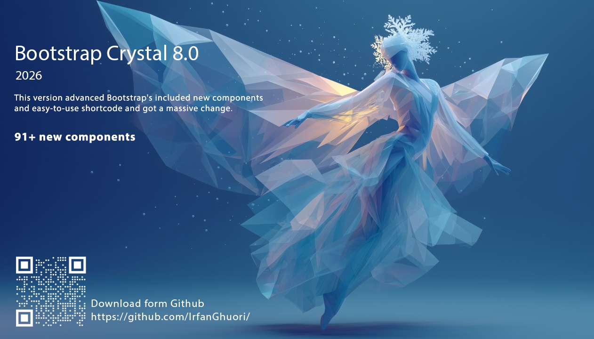

  
 

<!-- If the image is in the same folder as the README -->

# Glassmorphism effect update

  - Unlimited background colors
  - Set page cover image
  - Badges Redesigned
  - Button and checkbox Redesigned
  - Card Redesigned
  - Browser special title
  - Flat icons installed
  - Font-awesome installed
  - Simple-line-icons installed
  - Modal Redesigned
  - Play YouTube or Vimeo Videos with Modal
  - Texts limitation button
  - Navbar redesigned
  - 44 Image Hover effects
  - 16th Shadow Effects
  - Tooltips redesigned
  - Show notification with sound
  - Alert completely changed
  - Easily Add page-loading animation 
  - Glassmorphism effect backgrounds
  - 1000+ New Classes
  - Auto Broken Images Replacer
  - More Components
  

# Quick start
- Several quick start options are available:
- Download the latest release.
- Clone the repo: git clone https://github.com/IrfanGhuori/Bootstrap-Crystal.git
- Install with npm: npm install bootstrap-Crystal

  ## 💰 You can help me by Donating
   

  

